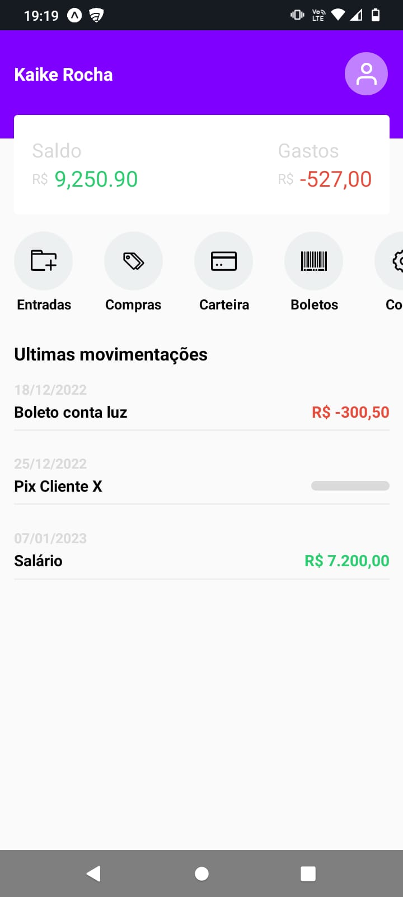

<h1 align="center">Aplicativo de Finaças</h1>

Evento gratuito, promovido pelo Sujeito Programador para ensino de tecnologias mobile.

  

## 🚀 Tecnologias

Esse projeto foi desenvolvido com as seguintes tecnologias:

- JavaScript
- React Native
- Git e Github

## 💻 Projeto

Uma interface simulativa de um app do banco
